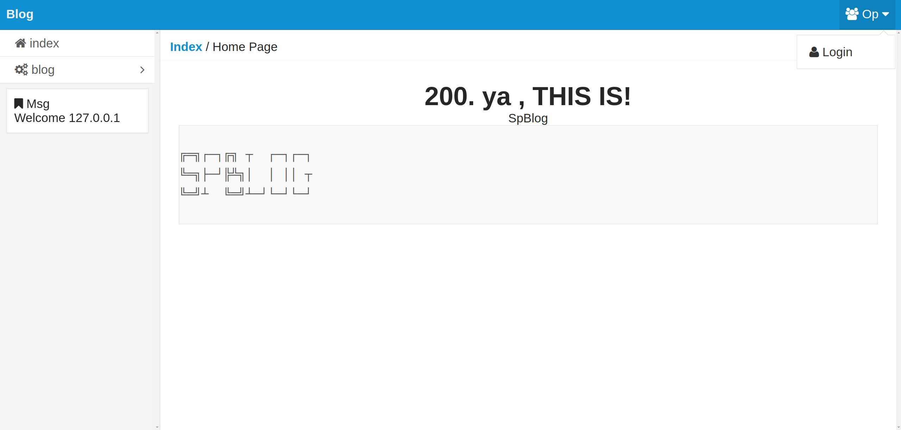
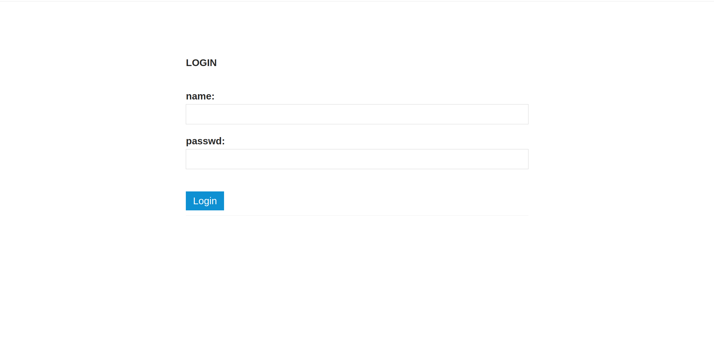
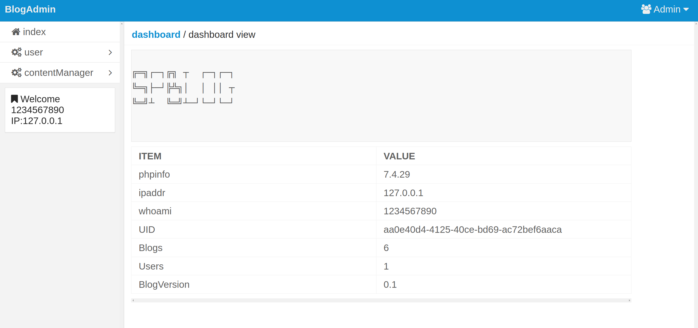
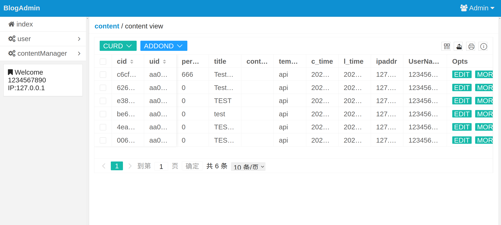
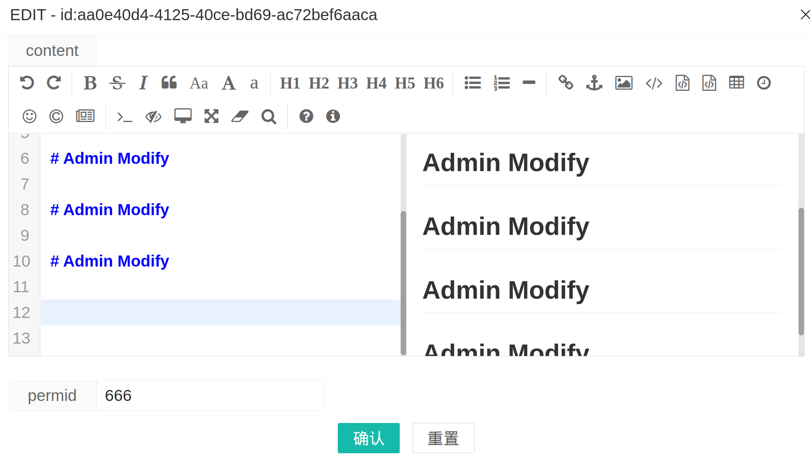
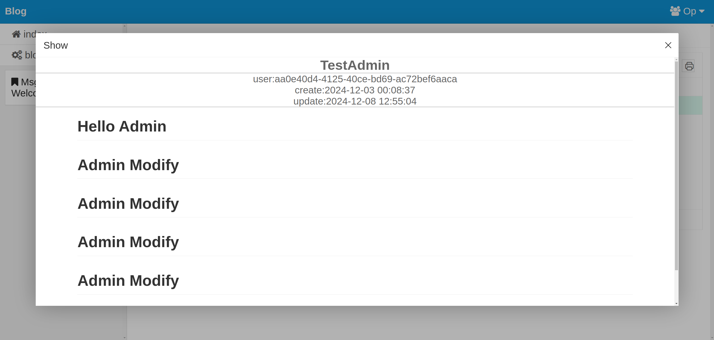
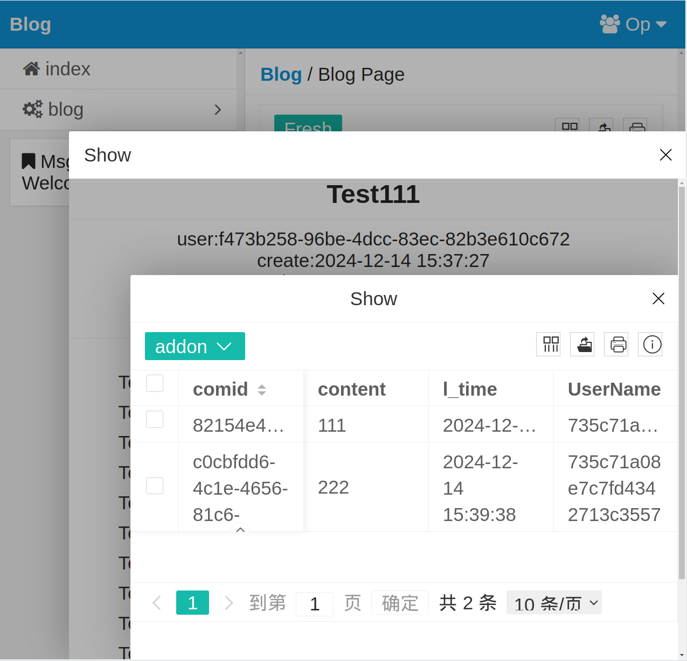
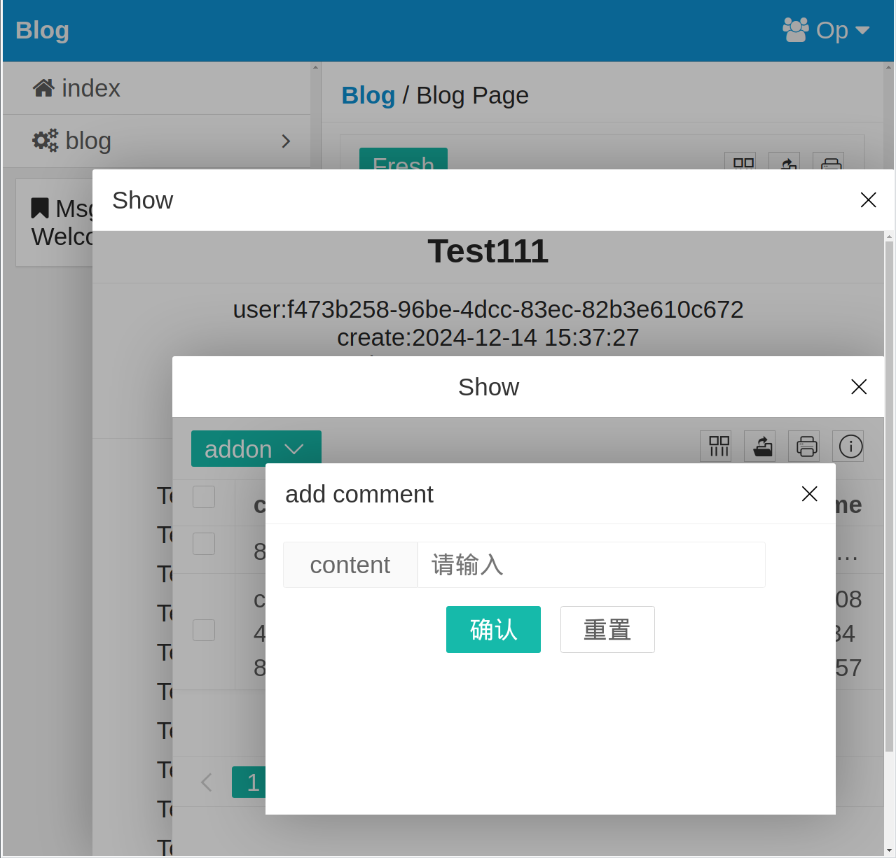
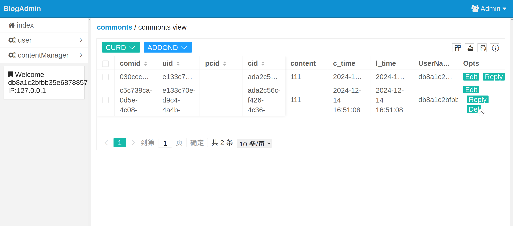

# THIS IS Spblog V0.1
# install
### 1 setup db
download lampp for php **`7.4`**
```$xslt
https://sourceforge.net/projects/xampp/files/XAMPP%20Linux/7.4.29/
```
install it
```$xslt 
./xampp-linux-x64-7.4.29-1-installer.run
```


### 2 create Blog Db
run install.php
```$xslt
php install.php 
```
input msg to connect db
```$xslt
=========Db_connect========
Host:127.0.0.1
Port:3306
User:.....
Passwd:.....
```
enter Blog Dbname
```$xslt
=========Create_Db========
Database:Blog2

```
skip
```$xslt
=========Create_Db========
Database:Blog2
C db Blog2 ok
Database:skip

```

### 3 AutoCreate Table And Account
```$xslt
=========Create_Table=====
relink to Blog2
Cuser

1Ccontent
Array
(
    [Tables_in_Blog2] => content
    [0] => content
)
Array
(
    [Tables_in_Blog2] => user
    [0] => user
)

===========C_data==============
relink to Blog2
===========OK==============

```

Account At user.json
```$xslt
{"user":"..........................","passwd":"......................."}
```

# start Blog
```$xslt
chmod 777 StartX.sh
./StartX.sh 
[sudo] password for xxxx: 
```

# images
index
[](./Doc/image/1.png)
login
[](./Doc/image/2.png)
admin
[](./Doc/image/3.png)
blog
[](./Doc/image/4.png)
permid
666 can show public

markdown editor
[](./Doc/image/5.png)
public
[](./Doc/image/6.png)

# NEW! 2024 03 25 add comment section 
can view nologin
[](./Doc/image/7.png)

post comment need login
[](./Doc/image/8.png)

URD Reply comments in admin pannel
[](./Doc/image/9.png)

update install.php

# Plan
review and rebuild code 
rewrite frontend webpage using vue3 

# NEWS 
20 12 2024 move index page to viewc , seperate view render and api in to diffrent module
23 12 2024 move index page to viewc , add top back view to comment section store comments using tree struct
